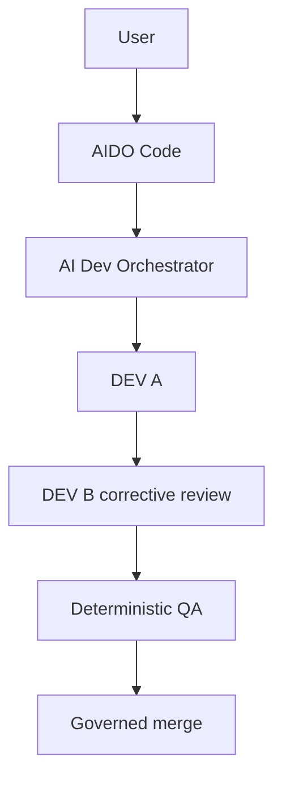

# AIDO Code

An interactive terminal for AI Dev Orchestrator.

AIDO Code gives you a Claude Code / Codex-style terminal experience,
backed by a governed multi-worker development engine. It never writes
your code itself: it drives AI Dev Orchestrator, which does.

## How it works



AIDO Code is the terminal: prompt, commands, output. AI Dev Orchestrator
is the engine: it picks workers, runs DEV A, DEV B review, QA, and the
merge. AIDO Code never makes any of those decisions itself; see
[`ARCHITECTURE.md`](ARCHITECTURE.md).

## Current status

| Milestone | Status |
|---|---|
| M1 — Minimal interactive shell | `DONE` |
| M1.1 — CLI conventions, standalone install | `DONE` |
| M1.2 — Rich provider quota status | `DONE` |
| M1.3 — Audit hardening | `DONE` |
| M1.4 — Autonomous AIDO project contract | `DONE` |
| M8 — `aido` command cutover | `DONE` — completed right after M1.4 (out of numeric order); see `ROADMAP.md`, M8 |
| M2 — Sessions and resume | `SPECIFIED`, not started, unaffected by M1.4/M8 |
| M3+ | `PLANNED` |

Each milestone's real, governed build is recorded factually in
[`docs/M1_REFERENCE_RUN.md`](docs/M1_REFERENCE_RUN.md) and
[`docs/M1_1_REFERENCE_RUN.md`](docs/M1_1_REFERENCE_RUN.md), including
two real engine defects those runs found and that were later fixed. Full
milestone detail and acceptance criteria: [`ROADMAP.md`](ROADMAP.md).

### Product model (M1.4)

**AIDO is the user product; `ai-dev-orchestrator` is its internal
engine.** A project AIDO governs never references a worker, a provider,
a model, or a `workers.yaml` path — it declares a project identity, a
`ROADMAP.md` (the executable source of truth, parsed deterministically),
a `resources/` directory, and a first instruction. AIDO resolves its own
global worker pool separately. Full contract:
[`docs/PROJECT_CONTRACT.md`](docs/PROJECT_CONTRACT.md).

## What AIDO Code is

Not a single agent, and not itself an orchestrator: a thin, stateful
client over AI Dev Orchestrator's multi-worker, multi-provider engine
(DEV A, then DEV B corrective review, then deterministic QA, then a
governed Git merge). AIDO Code talks to exactly one public API,
`orchestrator.engine.OrchestratorEngine`; see
[`docs/ENGINE_CONTRACT.md`](docs/ENGINE_CONTRACT.md) for the exact
contract this project is built against.

## Why this project exists

AI Dev Orchestrator originally shipped its own CLI (`aido
init/validate/run/status`) directly. P13 of that project's own
`ROADMAP.md` split the two concerns for good: the orchestrator stays a
reusable, headless engine, and the interactive terminal experience
becomes its own product, here.

## Quick start

AIDO Code is not published on PyPI yet. Build and install it from this
repository (or a local wheel):

```bash
git clone https://github.com/yannickameur/aido-code.git
cd aido-code
python -m pip install -e .
```

This installs `ai-dev-orchestrator` (the engine) as a dependency — no
separate checkout, and no manual worker configuration: AIDO Code
resolves its own global worker pool (see "Workers" below).

### Command names

`aido` is the real command (M8, `DONE`). `aido-code`/`python -m
aido_code` remain a compatibility alias, kept indefinitely — both
resolve to the exact same entry point, never a duplicated
implementation.

```bash
aido init . myproject   # scaffold a new project (manifest, DRAFT ROADMAP.md, resources/, Git)
cd myproject
```

Then:

1. fill in `README.md` (what the project is, for humans);
2. add any real reference material under `resources/`;
3. fill in `ROADMAP.md` — objective, acceptance criteria, WorkItems,
   dependencies, QA (`docs/PROJECT_CONTRACT.md`);
4. flip the current milestone's `Status:` from `DRAFT` to `APPROVED`
   once it's ready to execute;
5. validate:
   ```bash
   aido validate   # Current milestone: APPROVED / Executable
   ```
6. commit the project definition:
   ```bash
   git add README.md ROADMAP.md aido.yaml resources/
   git commit -m "Define initial project"
   ```
7. start governed development:
   ```bash
   aido run
   ```

No worker/provider/model configuration ever belongs in the project
itself. Inside the terminal (`aido` with no arguments):

```
/status           project + roadmap milestone + all AIDO-configured workers, no provider call
/workers          AIDO's own configured workers (never a project's)
/status --probe   same, plus a live provider/quota probe
/config           manifest + roadmap + resources + loaded engine facts
/validate         same validation as the CLI-level `aido validate`
/run              start or resume the project — requires the roadmap's Current milestone: Status: APPROVED
```

`/run` starts or resumes *project* execution, the engine's own WorkItem
flow — refused cleanly, before any provider call, while the current
milestone is still `DRAFT`. That is a different thing from session
resume (M2, not built yet), which restores AIDO Code's own conversation
state; see [`docs/SESSION_CONTRACT.md`](docs/SESSION_CONTRACT.md). Full
manifest/`ROADMAP.md` contract:
[`docs/PROJECT_CONTRACT.md`](docs/PROJECT_CONTRACT.md).

## Status and quota

`/status` and `/workers` list the configured workers: display name,
provider, model. Add `--probe` for live facts: provider availability
and quota, utilization, remaining, reset time, and reset credits where
a provider reports them.

- `/status`, `/workers`: no provider call.
- `/status --probe`, `/workers --probe`: one explicit, live provider
  probe.

## Workers

Workers belong to AIDO itself (`docs/PROJECT_CONTRACT.md` §4):
`$XDG_CONFIG_HOME/aido/workers.yaml` (or `~/.config/aido/workers.yaml`),
falling back — with nothing ever auto-materialized — to AIDO Code's own
packaged default workers below. A project never references a worker,
provider, model, or `workers.yaml` path again.

| Worker ID | Name | Provider | Default model |
|---|---|---|---|
| alice | Alice | Anthropic | sonnet |
| bob | Lydie | Anthropic | sonnet |
| victor | Victor | OpenAI | gpt-6-sol |
| oscar | Yannick | OpenAI | gpt-6-sol |
| milo | Nathaniel | Mistral | vibe-default |
| juno | Juno | Mistral | vibe-default |
| dana | Dana | DeepSeek | disabled |
| kai | Kai | Kimi | disabled |

Dana and Kai are configured but disabled: reaching them requires an API
key this environment does not have. See
[`CONTRIBUTORS.md`](CONTRIBUTORS.md) for who actually built AIDO Code
so far.

## Documentation

| Document | Purpose |
|---|---|
| [`ROADMAP.md`](ROADMAP.md) | where the project stands, what's next |
| [`ARCHITECTURE.md`](ARCHITECTURE.md) | AIDO Code / engine boundary |
| [`docs/PROJECT_CONTRACT.md`](docs/PROJECT_CONTRACT.md) | M1.4: manifest, `ROADMAP.md` grammar, resources, AIDO's own worker config |
| [`docs/CLI_SPEC.md`](docs/CLI_SPEC.md) | command/flag reference |
| [`docs/ENGINE_CONTRACT.md`](docs/ENGINE_CONTRACT.md) | the engine API AIDO Code consumes |
| [`docs/SESSION_CONTRACT.md`](docs/SESSION_CONTRACT.md) | M2 session data model |
| [`docs/M1_REFERENCE_RUN.md`](docs/M1_REFERENCE_RUN.md) | M1's real, governed build |
| [`docs/M1_1_REFERENCE_RUN.md`](docs/M1_1_REFERENCE_RUN.md) | M1.1's real, governed build |
| [`docs/M2_REAL_TEST_PLAN.md`](docs/M2_REAL_TEST_PLAN.md) | M2's post-build test scenarios |
| [`CONTRIBUTING.md`](CONTRIBUTING.md) | how to work on this project |
| [`CONTRIBUTORS.md`](CONTRIBUTORS.md) | who/what actually built it |

## How this project gets built

Not by a human or an assistant writing code directly into this
repository. AI Dev Orchestrator governs its own development the same
way it governed Morpion Web 3D: DEV A implements, DEV B reviews and
corrects, deterministic QA decides PASS/FAIL, a governed merge lands
the result. See [`CONTRIBUTING.md`](CONTRIBUTING.md).

## Contributors

See [`CONTRIBUTORS.md`](CONTRIBUTORS.md) for who/what actually produced
each governed commit (workers `Alice`/`Victor`, never a provider/vendor
name) and the project's own maintainer.

## Relationship to `ai-dev-orchestrator`

A separate Git repository, separate product, separate release cycle.
It depends on `ai-dev-orchestrator` as its engine, a normal Python
dependency. A sibling checkout of `ai-dev-orchestrator` is only a
developer convenience for working on both repositories at once (see
[`CONTRIBUTING.md`](CONTRIBUTING.md)) — not something a user needs. AIDO
Code never vendors or reimplements any orchestrator internals.
