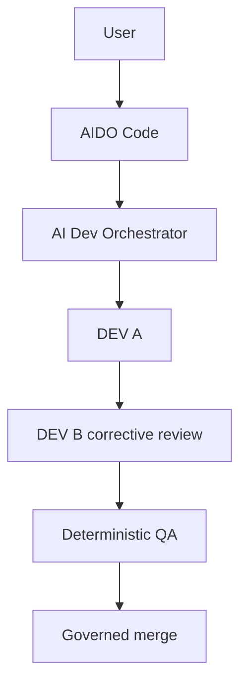

# AIDO Code

An interactive terminal for AI Dev Orchestrator.

AIDO Code gives you a Claude Code / Codex-style terminal experience,
backed by a governed multi-worker development engine. It never writes
your code itself: it drives AI Dev Orchestrator, which does.

## How it works



AIDO Code is the terminal: prompt, commands, output. AI Dev Orchestrator
is the engine: it picks workers, runs DEV A, DEV B review, QA, and the
merge. AIDO Code never makes any of those decisions itself; see
[`ARCHITECTURE.md`](ARCHITECTURE.md).

## Current status

| Milestone | Status |
|---|---|
| M1 — Minimal interactive shell | `DONE` |
| M1.1 — CLI conventions, standalone install | `DONE` |
| M1.2 — Rich provider quota status | `DONE` |
| M2 — Sessions and resume | `NEXT`, not started |
| M3+ | `PLANNED` |

Each milestone's real, governed build is recorded factually in
[`docs/M1_REFERENCE_RUN.md`](docs/M1_REFERENCE_RUN.md) and
[`docs/M1_1_REFERENCE_RUN.md`](docs/M1_1_REFERENCE_RUN.md), including
two real engine defects those runs found and that were later fixed. Full
milestone detail and acceptance criteria: [`ROADMAP.md`](ROADMAP.md).

## What AIDO Code is

Not a single agent, and not itself an orchestrator: a thin, stateful
client over AI Dev Orchestrator's multi-worker, multi-provider engine
(DEV A, then DEV B corrective review, then deterministic QA, then a
governed Git merge). AIDO Code talks to exactly one public API,
`orchestrator.engine.OrchestratorEngine`; see
[`docs/ENGINE_CONTRACT.md`](docs/ENGINE_CONTRACT.md) for the exact
contract this project is built against.

## Why this project exists

AI Dev Orchestrator originally shipped its own CLI (`aido
init/validate/run/status`) directly. P13 of that project's own
`ROADMAP.md` split the two concerns for good: the orchestrator stays a
reusable, headless engine, and the interactive terminal experience
becomes its own product, here.

## Quick start

AIDO Code is not published on PyPI yet. Build and install it from this
repository (or a local wheel):

```bash
git clone https://github.com/yannickameur/aido-code.git
cd aido-code
python -m pip install -e .
```

This installs `ai-dev-orchestrator` (the engine) as a dependency,
including its own `aido` command — no separate checkout or manual
worker configuration required.

```bash
aido init        # scaffold a project's aido.yaml
aido validate    # check it before running anything
aido-code        # launch the AIDO Code terminal
```

Inside the terminal:

```
/status           project + workers, no provider call
/workers          configured workers
/status --probe   project + workers, plus a live provider/quota probe
/run               start or resume the project
```

`/run` starts or resumes *project* execution, the engine's own WorkItem
flow. That is a different thing from session resume (M2, not built
yet), which restores AIDO Code's own conversation state; see
[`docs/SESSION_CONTRACT.md`](docs/SESSION_CONTRACT.md).

## Status and quota

`/status` and `/workers` list the configured workers: display name,
provider, model. Add `--probe` for live facts: provider availability
and quota, utilization, remaining, reset time, and reset credits where
a provider reports them.

- `/status`, `/workers`: no provider call.
- `/status --probe`, `/workers --probe`: one explicit, live provider
  probe.

## Workers

The current registry (`ai-dev-orchestrator`'s `config/workers.yaml`):

| Worker ID | Name | Provider | Default model |
|---|---|---|---|
| alice | Alice | Anthropic | sonnet |
| bob | Lydie | Anthropic | sonnet |
| victor | Victor | OpenAI | gpt-6-sol |
| oscar | Yannick | OpenAI | gpt-6-sol |
| milo | Nathaniel | Mistral | vibe-default |
| juno | Juno | Mistral | vibe-default |
| dana | Dana | DeepSeek | disabled |
| kai | Kai | Kimi | disabled |

Dana and Kai are configured but disabled: reaching them requires an API
key this environment does not have. See
[`CONTRIBUTORS.md`](CONTRIBUTORS.md) for who actually built AIDO Code
so far.

## Documentation

| Document | Purpose |
|---|---|
| [`ROADMAP.md`](ROADMAP.md) | where the project stands, what's next |
| [`ARCHITECTURE.md`](ARCHITECTURE.md) | AIDO Code / engine boundary |
| [`docs/CLI_SPEC.md`](docs/CLI_SPEC.md) | command/flag reference |
| [`docs/ENGINE_CONTRACT.md`](docs/ENGINE_CONTRACT.md) | the engine API AIDO Code consumes |
| [`docs/SESSION_CONTRACT.md`](docs/SESSION_CONTRACT.md) | M2 session data model |
| [`docs/M1_REFERENCE_RUN.md`](docs/M1_REFERENCE_RUN.md) | M1's real, governed build |
| [`docs/M1_1_REFERENCE_RUN.md`](docs/M1_1_REFERENCE_RUN.md) | M1.1's real, governed build |
| [`docs/M2_REAL_TEST_PLAN.md`](docs/M2_REAL_TEST_PLAN.md) | M2's post-build test scenarios |
| [`CONTRIBUTING.md`](CONTRIBUTING.md) | how to work on this project |
| [`CONTRIBUTORS.md`](CONTRIBUTORS.md) | who/what actually built it |

## How this project gets built

Not by a human or an assistant writing code directly into this
repository. AI Dev Orchestrator governs its own development the same
way it governed Morpion Web 3D: DEV A implements, DEV B reviews and
corrects, deterministic QA decides PASS/FAIL, a governed merge lands
the result. See [`CONTRIBUTING.md`](CONTRIBUTING.md).

## Contributors

See [`CONTRIBUTORS.md`](CONTRIBUTORS.md) for who/what actually produced
each governed commit (workers `Alice`/`Victor`, never a provider/vendor
name) and the project's own maintainer.

## Relationship to `ai-dev-orchestrator`

A separate Git repository, separate product, separate release cycle.
It depends on `ai-dev-orchestrator` as its engine, a normal Python
dependency. A sibling checkout of `ai-dev-orchestrator` is only a
developer convenience for working on both repositories at once (see
[`CONTRIBUTING.md`](CONTRIBUTING.md)) — not something a user needs. AIDO
Code never vendors or reimplements any orchestrator internals.
